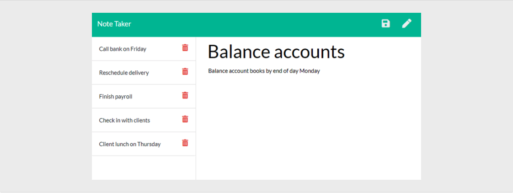

# note-taker

<h2 style="display: inline-block">Table of Contents</h2>

<ol>
<li>
<a href="#description">Description</a>
</li>
<li>
<a href="#getting-started">Getting Started</a>
</li>
<li>
<a href="#installation">Installation</a>
</li>
<li>
<a href="#usage">Usage</a>
</li>
<li>
<a href="#license">License</a>
</li>
<li>
<a href="#contribute">Contribute</a>
</li>
<li>
<a href="#questions">Questions</a>
</li>
</ol>

## Description

An application called Note Taker that can be used to write and save notes. This application will use an Express.js back end and will save and retrieve note data from a JSON file.

## Getting Started

To get a local copy up and running follow these simple steps. You can also download the source files provided. You will need a text editor such as Visual Studio Code.

## Installation

Clone this repo: github.com/justpeachy8688/note-taker to your local device. Use npm i to install dependencies.

## Usage

"Lorem ipsum dolor sit amet, consectetur adipiscing elit, sed do eiusmod tempor incididunt ut labore et dolore magna aliqua. Ut enim ad minim veniam, quis nostrud exercitation ullamco laboris nisi ut aliquip ex ea commodo consequat. 

## License

MIT | See badge above.

## Contribute

To contribute to this project: "Lorem ipsum dolor sit amet, consectetur adipiscing elit, sed do eiusmod tempor incididunt ut labore et dolore magna aliqua. Ut enim ad minim veniam, quis nostrud exercitation ullamco laboris nisi ut aliquip ex ea commodo consequat. 

## Questions?

If you have any additional questions, email me here: tsanders3515@gmail.com
 Or visit my GitHub profile here: github.com/justpeachy8688
